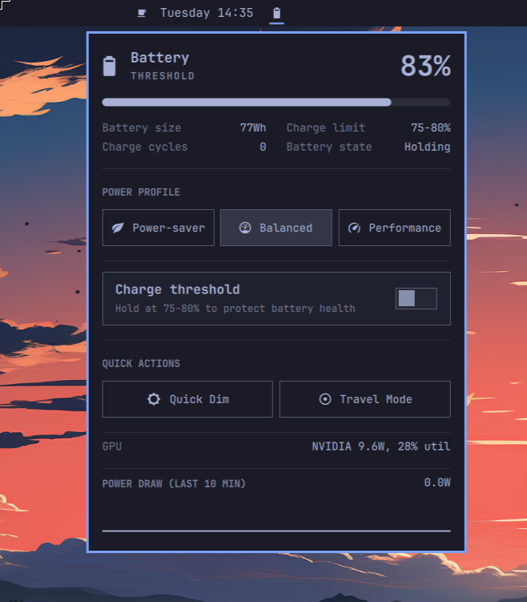

<div align="center">

# Better Battery for Omarchy

**An enhanced power/battery bar widget for [Omarchy](https://omarchy.org/) — everything the built-in Power widget does, plus a charge-threshold toggle, Quick Dim, Travel Mode, hybrid-GPU status, and a live power-draw history.**

[](LICENSE)
[](manifest.json)
[](https://omarchy.org/)

*Maintained fork by [cmyk](https://github.com/cmyk), based on [AROICE-HQ/omarchy-battery](https://github.com/AROICE-HQ/omarchy-battery). Original plugin by aryan-techie / AROICE.*

[Features](#features) • [Install](#install) • [Usage](#usage) • [How it works](#how-it-works)

</div>

Omarchy's built-in Power widget is already solid: battery percentage, an
animated charge bar, size/cycles/time/rate stats, and a power-profile
picker. This plugin clones that code as-is and adds five things aimed
specifically at laptops: a real charge-threshold toggle, a one-click dim,
a travel preset, hybrid-GPU status, and a short power-draw history —
inspired by `laptop-power-center` and `battery-usage` on the marketplace.

It installs as its own independent plugin — both it and the built-in
widget can be enabled at once, so you can compare them side by side before
deciding which stays on your bar.



## Contents

- [Features](#features)
- [Install](#install)
- [Usage](#usage)
- [How it works](#how-it-works)
- [External dependencies](#external-dependencies)
- [Uninstalling](#uninstalling)
- [Changelog](#changelog)
- [License](#license)
- [Author](#author)

## Features

Everything the built-in `omarchy.power` already has:

- Battery percentage with an animated charge bar and status icon.
- Battery size, charge cycles, time to full/empty, charge rate.
- Charge-threshold *detection* — shows "Holding" when firmware-level charge
  protection is already active.
- Power-profile picker (power-saver / balanced / performance).

New in this plugin:

- **Charge-threshold toggle** — turns firmware-backed charge protection on
  or off, at whatever start/end percentages your hardware already reports.
  Goes through UPower's own `EnableChargeThreshold` method (the same
  DBus/polkit path UPower ships for this), not a raw sysfs write. Only
  shown when your battery actually reports a configured threshold.
- **Quick Dim** — one click drops your laptop panel to 40% brightness;
  click again to restore the exact value it was at. Reads the current
  brightness first, so a setup with no laptop panel active (docked to an
  external monitor, say) just does nothing rather than guessing.
- **Travel Mode** — bundles power profile, brightness, and this monitor's
  refresh rate into one save/restore pair: switches to power-saver, dims
  to 40%, and caps refresh to 60Hz, then puts all three back exactly as
  they were. Session-only — nothing here persists past a restart.
- **GPU status** — power draw and utilization for the discrete GPU, shown
  only on hybrid-graphics laptops (detected via Omarchy's own `omarchy hw
  hybrid gpu`). Status only, no mode switching — nothing here would ever
  need a logout/reboot to take effect.
- **Power draw history** — a short in-memory sparkline of the last 10
  minutes' draw, plus a live watts readout. No database, no persistence;
  it's gone the moment the shell restarts.
- **Power impact** — ranks the three busiest applications from a recent
  one-second CPU sample, grouped by process name. It samples only while the
  panel is open and labels the result as an estimate rather than pretending
  Linux exposes exact per-application watts.
- **Battery temperature** — shows the battery's real temperature sensor when
  the hardware exposes it through Linux's power-supply interface.

## Install

```
omarchy plugin add https://github.com/cmyk/omarchy-battery.git --enable
```

Or, to develop/inspect it locally first:

```
omarchy plugin clone io.github.aryan-techie.battery --edit
```

(swap in this repo's contents, or copy this folder to
`~/.config/omarchy/plugins/io.github.aryan-techie.battery/` directly and
run `omarchy-shell shell rescanPlugins` if it doesn't pick up right away).

## Usage

Everything from the built-in widget works the same way — click the bar
pill to open the panel, click a profile pill to switch it.

- **Charge threshold**: flip the toggle under Power Profile. Only appears
  if your hardware supports it.
- **Quick Dim** / **Travel Mode**: one click each in Quick Actions; click
  again to undo. Both are safe to leave on indefinitely — closing the
  panel or restarting the shell doesn't lose the saved state, only a
  restart of the whole session does (by design — these are meant to be
  short-lived, not permanent settings).
- **GPU** and **power draw** sections need no interaction; they just show
  what's currently true.

## How it works

- **Charge threshold**: reads/writes UPower's `ChargeThresholdEnabled`
  property and `EnableChargeThreshold` method via `gdbus call` against
  `org.freedesktop.UPower`, targeting whichever battery `upower -e`
  reports. The actual start/end percentages come from
  `omarchy-battery-status --shell`'s existing `threshold` field — this
  plugin only toggles enforcement, it doesn't set arbitrary percentages.
- **Quick Dim / Travel Mode brightness**: `omarchy brightness display
  --monitor eDP-2`, read before changing (to know what to restore) and
  written after. A read that can't resolve a number — no internal panel
  currently active — means the brightness leg of either feature is
  skipped, not guessed at.
- **Travel Mode refresh rate**: `hyprctl monitors -j` to read the focused
  monitor's current mode, then `hyprctl keyword monitor` to reapply it
  with only the refresh rate changed — resolution, position, and scale
  always round-trip untouched.
- **GPU status**: `omarchy hw hybrid gpu` gates visibility;
  `nvidia-smi --query-gpu=power.draw,utilization.gpu` supplies the numbers
  when present.
- **Power draw history**: reuses the `rate` field already in every
  `omarchy-battery-status --shell` sample (the same one the built-in
  widget's stats row shows as text) and keeps a rolling 10-minute window
  of it in memory — no new subprocess, no database.
- **Power impact**: `power-impact.sh` reads per-process CPU counters twice,
  one second apart, groups the deltas by application name, and returns the
  three busiest groups. It runs only while the panel is open. CPU activity is
  a useful power proxy, not a per-application watt measurement.
- **Battery temperature**: `battery-temperature.sh` reads the first available
  `BAT*/temp` sensor, converts the Linux tenths-of-a-degree value to Celsius,
  and emits nothing on unsupported hardware so the row stays hidden.
- **Settings**: none of the five add persisted preferences. Charge
  threshold reflects live hardware state; Quick Dim/Travel Mode are
  session-only toggles; GPU status and power draw are live/derived.

## External dependencies

Runs `gdbus`, `omarchy brightness`, `hyprctl`, `omarchy hw`, `upower`, and
(only on hybrid-GPU hardware) `nvidia-smi` via Quickshell's `Process` — all
standard on any Omarchy install except `nvidia-smi`, which is only invoked
when `omarchy hw hybrid gpu` already confirms NVIDIA hardware is present.
Nothing here touches the network or needs elevated privileges beyond what
UPower's own polkit policy already grants for charge-threshold changes.

## Uninstalling

```
omarchy plugin remove io.github.aryan-techie.battery
```

This removes the plugin and its bar entry. The built-in Power widget (if
you still have it enabled) is unaffected.

## Changelog

See [CHANGELOG.md](CHANGELOG.md).

## License

MIT — see [LICENSE](LICENSE).

## Author

**Aryan Techie** ([Aryan Jangra](https://aryan.aroice.in))

- 🌐 Website: [aryan.aroice.in](https://aryan.aroice.in)
- 📧 Email: [aryan@aroice.in](mailto:aryan@aroice.in)
- 🐙 GitHub: [@Aryan-Techie](https://github.com/Aryan-Techie)
- 🏢 Organization: [AROICE](https://aroice.in)

---

<div align="center">

**Made with ❤️ by [AROICE](https://github.com/AROICE-HQ)**

*Clear tools for a clear mind.*

</div>

## Intel Mac charging controls

The charging section offers a 20–100% slider and **Apply**, plus **Top up to
100%** / **Cancel top-up**. Applying a limit ends any top-up. The saved limit
is restored within five seconds of detecting unplugging, including when the
panel is closed. Top-up state persists across reboot: it continues if AC is
connected, or restores the saved limit when the service starts on battery.
An unplug/replug entirely while the machine is off cannot be detected.

This backend requires an Intel MacBook exposing a one-byte `BCLM` SMC key.
Verified on MacBookPro8,2 only; other models remain experimental. It does not
force discharge. Existing UPower threshold controls remain available on other
hardware. A stale or unavailable helper hides the Mac-specific section.

Build and install the optional helper from this checkout:

```sh
cc -O2 -Wall -Wextra -Werror -o charging/omarchy-bclm charging/bclm.c
sudo bash charging/install.sh
```

The root-owned helper accepts only `set 20..100`, `topup`, `cancel`, and its
service's `watch` command. GUI changes authenticate through polkit. The
service serializes operations, verifies firmware readback, and stores its
intent/status in `/var/lib/omarchy-charge/state.json`. The UI watches that file
without privilege or periodic subprocesses. The service caches SMC discovery and
refreshes unchanged status every 15 seconds while still checking unplugging every
five seconds. The low-level writer is adapted from Jordan Brough's
macbook-charge-limit to write **BCLM only**, retaining its MIT license in
`charging/LICENSE.bclm`.

To remove the helper and restore normal charging, first run
`sudo /usr/local/libexec/omarchy-charge set 100`, then disable the service with
`sudo systemctl disable --now omarchy-charge.service`. Remove the two
`/usr/local/libexec/omarchy-*` helper files and its service/state files if desired.
Do not use a wildcard when removing helpers.

Validation: `python3 -m unittest discover -s charging -v`.

Plugin updates follow this fork’s `main` branch. The privileged charging helper
is installed separately: after changes under `charging/`, rebuild and rerun its
installer to update the system copy. Plugin updates never silently install root code.
